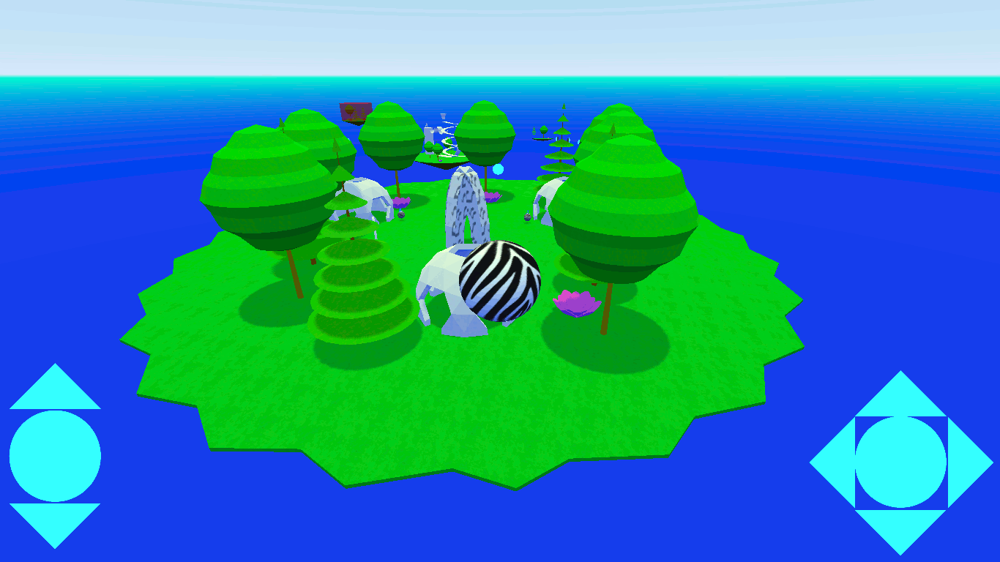

# 📥 Download Albahl Episode 2

  

_Available for Windows, Linux, Android, and now playable in your browser!_  

## 🌐 Play in Your Browser  
🎮 **[Play Now](https://jacksonelfersbd8.github.io/ab2/)** – No download required!  

---

## 🖥️ Desktop Versions  
| Platform | Download |
|----------|----------|
| 🪟 **Windows** | [Download albahl_2.zip](https://github.com/jacksonelfersbd8/ab2/raw/refs/heads/master/windows/albahl_2.zip) |
| 🐧 **Linux** | [Download albahl_2.zip](https://github.com/jacksonelfersbd8/ab2/raw/refs/heads/master/linux/albahl_2.zip) |

## 📱 Mobile Version  
| Platform | Download |
|----------|----------|
| 🤖 **Android** | [Download albahl_2.zip](https://github.com/jacksonelfersbd8/ab2/raw/refs/heads/master/android/albahl_2.zip) |

---

## 📜 Installation Instructions  
### 🖥️ Windows & Linux  
1. Download the correct `.zip` file for your platform.  
2. Extract the contents.  
3. Run the executable file (`albahl_2.exe` for Windows, `albahl_2.x86_64` for Linux).  

### 📱 Android  
1. Download the `.zip` file and extract it.  
2. Install the `.apk` file (if included) or move the extracted folder to the correct directory.  
3. Run the game.  

---

## 🎮 How to Play  
| Control | Action |
|---------|--------|
| **WASD / Arrow Keys** | Move the ball |
| **Mouse** | Look around |
| **Shift** | Interact with objects |

---

## ℹ️ About Albahl  
_Albahl is an episodic series of a ball, dancing to the beat, and helping its village people—minus the YMCA. It's all about rhythm and puzzles, while taking flight as a spherical, zebra-patterned orb._  

